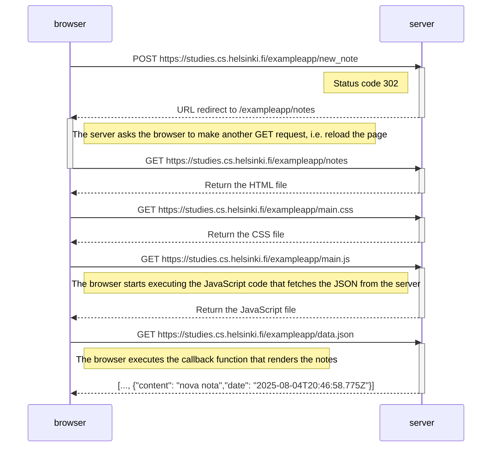

```mermaid
sequenceDiagram
    participant browser
    participant server

    browser->>server: POST https://studies.cs.helsinki.fi/exampleapp/new_note
    activate server
    Note left of server: Status code 302
    server-->>browser: URL redirect to /exampleapp/notes
    deactivate server

    activate browser
    Note right of browser: The server asks the browser to make another GET request, i.e. reload the page
    browser->>server: GET https://studies.cs.helsinki.fi/exampleapp/notes
    deactivate browser
    activate server
    server-->>browser: Return the HTML file
    deactivate server
    
    browser->>server: GET https://studies.cs.helsinki.fi/exampleapp/main.css
    activate server
    server-->>browser: Return the CSS file
    deactivate server

    browser->>server: GET https://studies.cs.helsinki.fi/exampleapp/main.js
    activate server
    Note right of browser: The browser starts executing the JavaScript code that fetches the JSON from the server
    server-->>browser: Return the JavaScript file
    deactivate server

    browser->>server: GET https://studies.cs.helsinki.fi/exampleapp/data.json
    activate server
    Note right of browser: The browser executes the callback function that renders the notes
    server-->>browser: [..., {"content": "nova nota","date": "2025-08-04T20:46:58.775Z"}]
    deactivate server
```