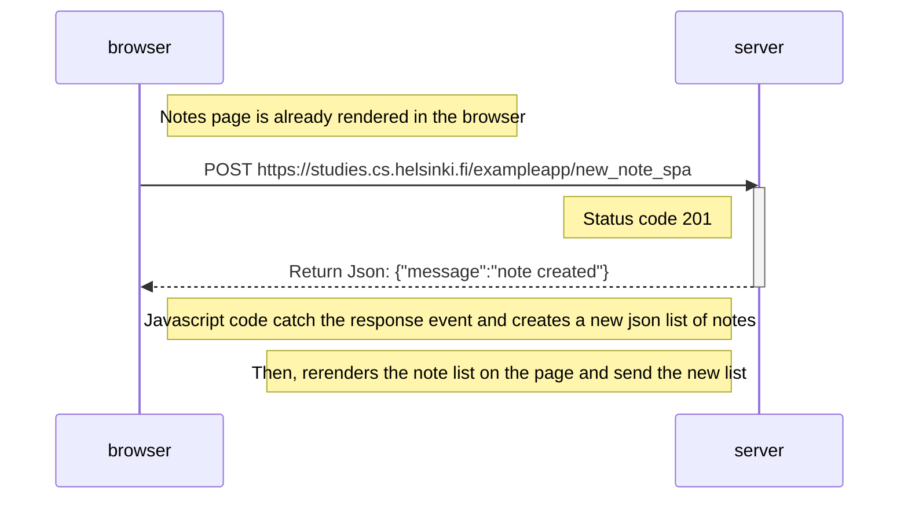

```mermaid
sequenceDiagram
    participant browser
    participant server

    Note right of browser: Notes page is already rendered in the browser
    
    browser->>server: POST https://studies.cs.helsinki.fi/exampleapp/new_note_spa
    activate server
    Note left of server: Status code 201
    server-->>browser: Return Json: {"message":"note created"}
    deactivate server
    Note left of server: Javascript code catch the response event and creates a new json list of notes
    Note left of server: Then, rerenders the note list on the page and send the new list
```